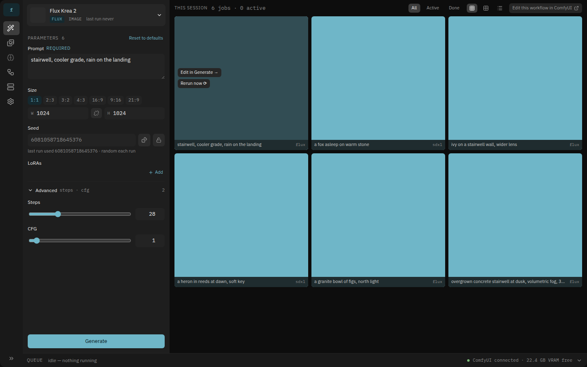
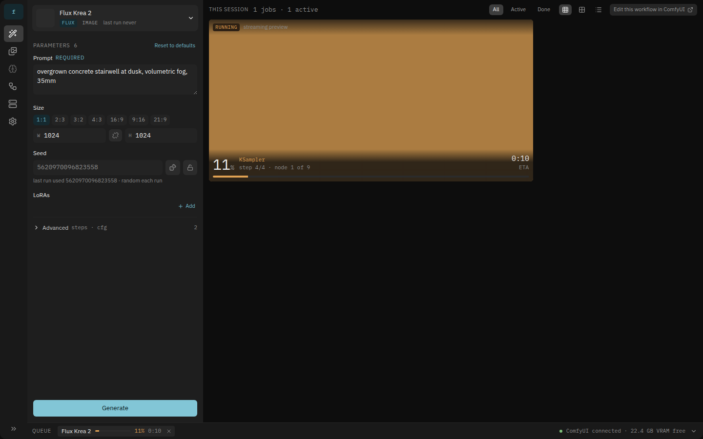
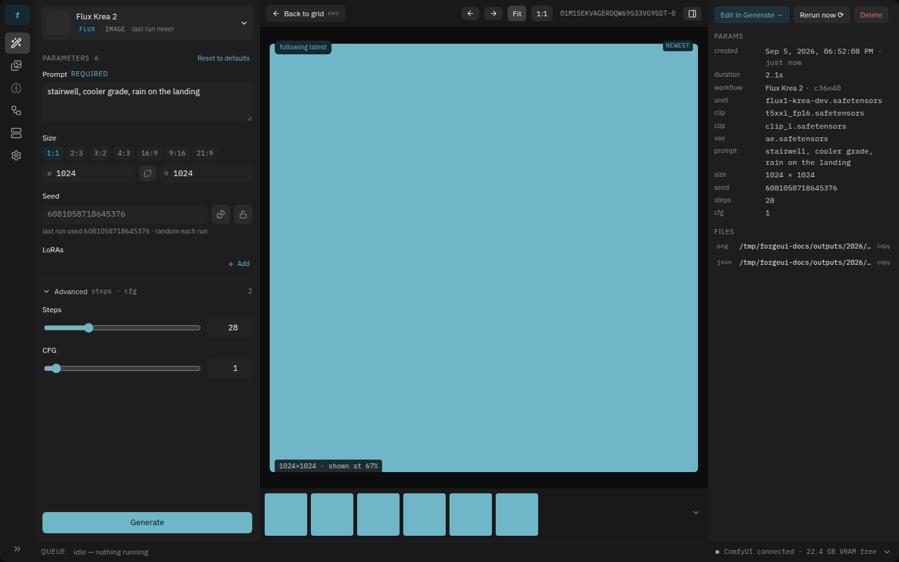
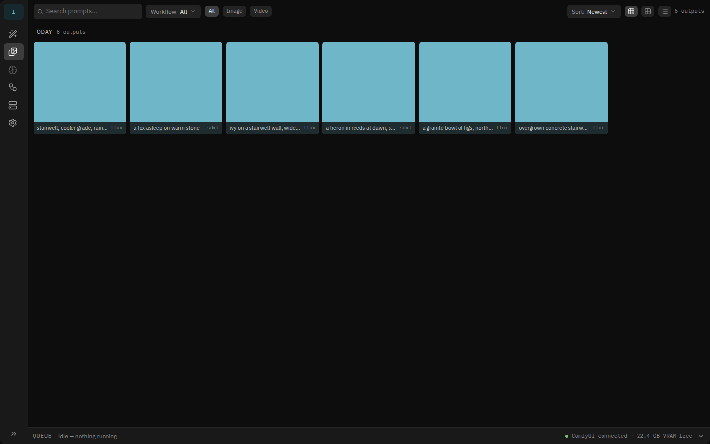
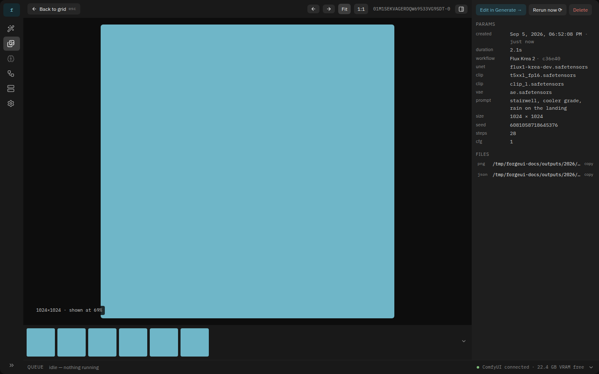
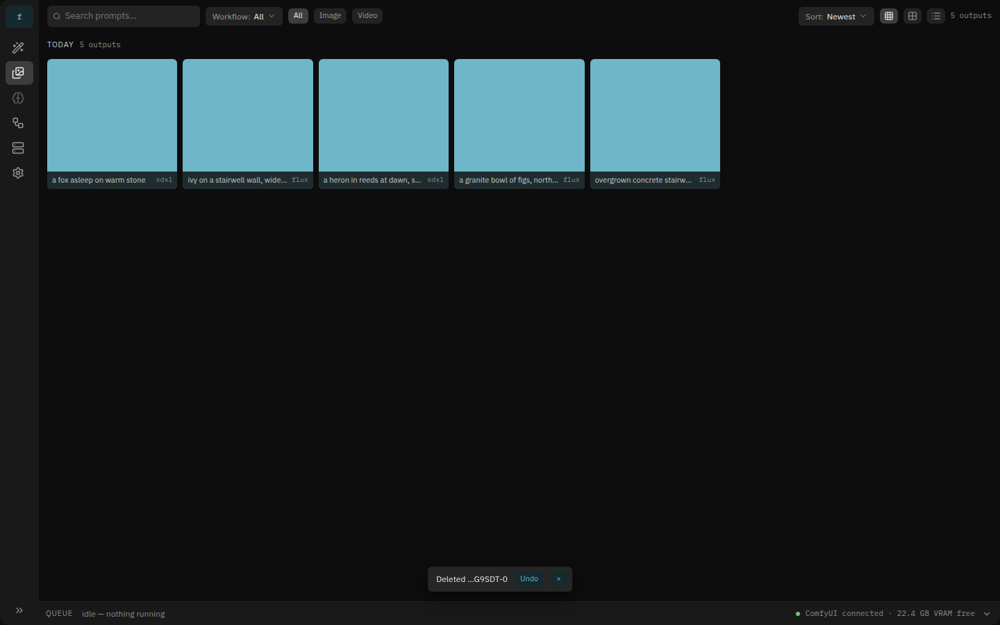
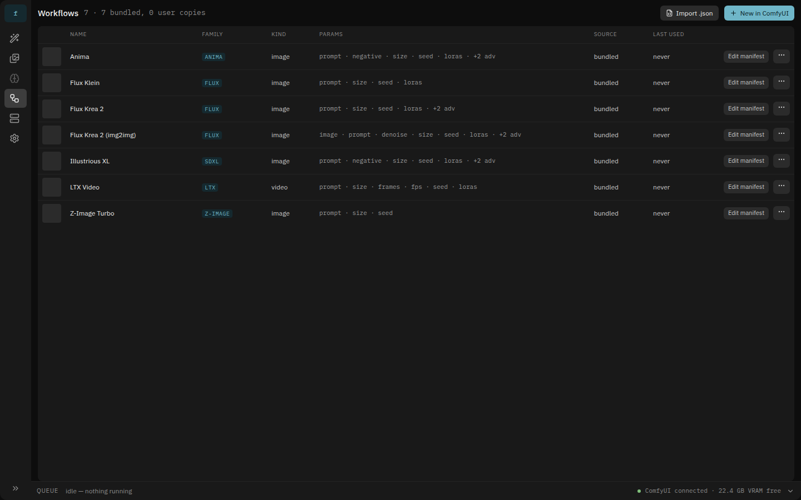
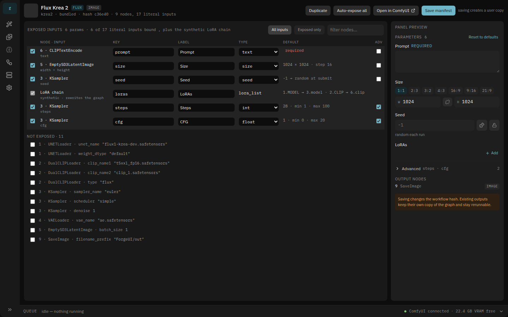
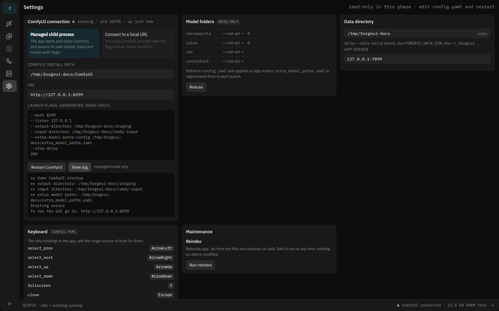

# Phase 1 — completion handoff

Phase 1 of `IMPLEMENT-PHASE-1.md` is complete: M0 through M4, one commit each
plus two bug-fix commits (`7bafc9a` → `71956ae`). All nine points of that
document's definition of done are met, with the caveats below.

A person can start the app, pick a bundled workflow, type a prompt, press
Generate, watch progress, see the image land in the session grid, click it to
view it, find it later in the Gallery, and reproduce it — and every byte needed
to do that is on disk, not just in memory.

**Nothing in this repository has run against a real ComfyUI.** Every test uses
the in-process fake. Read "Before trusting it on real hardware" below first.

## What it looks like

Taken from the end-to-end run against the fake ComfyUI;
`tests/e2e/shots.spec.ts` regenerates all of them. Every image is a flat teal
square because the fake writes a solid fixture PNG — there is no model here.

Generate: the workflow card and its picker at the top of the param panel, the
panel rendered from the manifest alone, and this session's results on the
right. Compare with mock frame 01.



A job in flight — percent, ETA, node label and step counter over the preview
frames ComfyUI streams, with the running chip in the queue strip. The card
spans two columns so the numbers stay readable at a distance.



The focused view keeps the panel at 360px and uses Gallery's viewer layout,
with the follow-latest chip and the "newest" badge of §11.4.



Gallery: filters as URL params, day dividers whose counts arrive from a
separate call, and the tiles / table toggle.



The viewer, shared with Generate: metadata sidebar in §11.2's order, copyable
absolute paths under FILES, and the filmstrip walking the filtered set.



Delete has no confirmation — the tile goes, the counts follow, and an undo
toast stands in for it while the bytes wait out the window.



The workflows table is the manifest surface at a glance, and the manifest
editor of §4.7 lists exposed inputs in panel order with the synthetic LoRA
chain row and a live panel preview.





Settings renders the `config.yaml` sections of frame 08 read-only, including
the generated launch flags and the managed child's captured log.



Also in that directory: `generate-workflow-picker.png` (grouped by family and
kind) and `gallery-table.png` (MODELS chips, SIZE, seed, DURATION).

## State

| | |
|---|---|
| Backend | 49 TypeScript modules under `src/`, 22 HTTP routes |
| Frontend | Svelte 5 SPA, 21 components under `src/frontend/src/` |
| Tests | `deno task test` 180 · `deno task test:ui` 22 · `deno task test:e2e` 3 |
| Clean | `deno fmt`, `deno lint`, `deno check`, `svelte-check`, `prettier` |

```
src/
  main.ts        CLI, boot order, the App handle tests use
  config/        config.yaml layers, CLI overrides, extra_model_paths.yaml
  db/            schema.sql (verbatim §7), migrations, every SQL statement
  comfy/         http client, ws client, child process, launch flags, proxy
  workflows/     manifest validation, coercion, rewrite, loader, litegraph
  jobs/          pipeline, completion, progress, sidecar, png
  outputs/       gallery queries, soft delete, reindex
  models/        the minimal read-only scan Phase 1 needs
  http/          router, routes/*, /ws hub, media, static
  frontend/      the Svelte app (npm + Vite; the only non-Deno toolchain)
tests/
  unit/ integration/ golden/ fake-comfy/ fixtures/ e2e/
workflows/bundled/<id>/   the seven of §4.6, plus their README
```

## Decisions worth knowing before you touch anything

**SQLite must be opened with `int64`.** `@db/sqlite` binds integers through a
32-bit path otherwise and silently truncates them, which is every `created_at`
in §7. Always open through `openDatabase()` / `DATABASE_OPTIONS`
(`src/db/db.ts`). A generation once landed in `outputs/1970/01/22/` because of
this, and the tests missed it — they compared the day directory against the
same broken value.

**The app chooses the `prompt_id`** and writes it to the job row *before*
`POST /prompt`. ComfyUI honours a supplied id; a build that ignores it and
answers with its own is accommodated. Without this, the first websocket events
arrive before the app knows which job they belong to and jobs hang in `queued`.

**A job's `created_at` is truncated to the second**, because §6.2 records
sidecar timestamps to the second and the sidecar is the source of truth. That
is what makes the reindex test an equality rather than an approximation.
Durations come from `started_at`/`finished_at`, which stay in milliseconds.

**Sidecars outrank the database.** `reindex` rebuilds `outputs`,
`output_models`, the FTS index and missing `jobs` rows from the files, and a
row's `sha256` is recomputed from the bytes on disk rather than read from
anywhere. Anything you would store only in the DB about an output has to go in
the sidecar first (and DESIGN.md before that).

**Websocket payload shapes are shared.** The `output` event carries the same
decorated shape `GET /api/outputs` returns (`media_url`, `generation_ms`,
`models`), because it once carried the raw row and live tiles had no image
source until a reload.

## What is deliberately absent

Out of Phase 1's scope, and not stubbed: model and LoRA pages, hashing,
samples, Civitai, content-addressed inputs, `image`/`mask`/`video` params, Use
in workflow, Upscale image, video outputs, ETA from node timings (equal
weights, §5.1's fallback), Settings beyond a read-only view, `deno compile`.

Consequences you will see in the UI: the Models rail slot is present but
disabled; the LoRA and checkpoint pickers list filenames with no counts,
families or thumbnails; `image` params render an explicit "arrives in a later
phase" note, so `krea2-img2img` and `ltx` load and list but cannot generate.

## Breadcrumbs left for Phase 2

- `src/models/scan.ts` is the minimal scan; extend it rather than replace it.
- `insertOutputModels()` skips models with no hash, which is all of them today.
  Once hashing exists, `reindex` fills those rows from the sidecars — every
  sidecar already records `models: [{ role, name, hash: null }]`.
- Every sidecar already carries `timing.nodes`, so the data to seed node
  weights exists for outputs generated before Phase 2 ships. `node_timings` is
  migrated and empty.
- `FAMILIES` lives in `src/workflows/types.ts` and manifest `filter.family` is
  validated. `GET /api/families` is not implemented.
- The gallery's `models` filter already ANDs over `output_models` and has a
  test that seeds the rows by hand.

## Before trusting it on real hardware

1. **Write the contract check.** §14.1 describes an opt-in test tagged `comfy`
   that runs a trivial graph (`EmptyImage` → `SaveImage`) against a real local
   ComfyUI to verify the assumptions the fake is built on. It was never
   written, and the fake underpins every other test. This is the highest-value
   next task.
2. **Verify the embedded editor.** `Save & return` calls
   `app.graphToPrompt()` on the same-origin iframe (`src/frontend/src/screens/Comfy.svelte`).
   This path cannot run without ComfyUI; it reports plainly when the build does
   not expose it rather than failing silently. `IMPLEMENT-PHASE-1.md` says to
   stop and ask if it is unreachable.
3. **Fix the bundled model names.** Every filename in `workflows/bundled/` is a
   placeholder — see the README there. Open each workflow in ComfyUI, pick real
   files, and Save & return, which writes both json files into a user copy.
4. **Check the details the fake cannot prove:** that `prompt_id` is honoured,
   that binary preview frames arrive, that `--output-directory` really puts
   files in `staging/<jobid>/`, and that `/comfy/*` serves ComfyUI's frontend
   through the proxy.

## Running it

```sh
deno task ui:install && deno task ui:build   # once, then whenever the UI changes
deno task start --data-dir ./data
deno task test && deno task test:ui && deno task test:e2e
```

`deno check`/`lint`/`fmt` exclude `src/frontend/` and the Playwright specs;
those have their own toolchain (`ui:check`, `ui:fmt`, `test:ui`).

## Amendments made to DESIGN.md

DESIGN.md stayed authoritative; three edits were made to it before the code
that needed them, per the conventions:

- §3.1 names the five `config.yaml` blocks, including `server` and
  `comfy.python` / `comfy.extra_args`.
- §5 records the client-chosen `prompt_id`, the binary preview frame layout,
  and the reconcile pass on every reconnection.
- §12 lists `GET /api/jobs/:id`, the extra fields on an output row, and the
  days endpoint's `tz_offset`.
