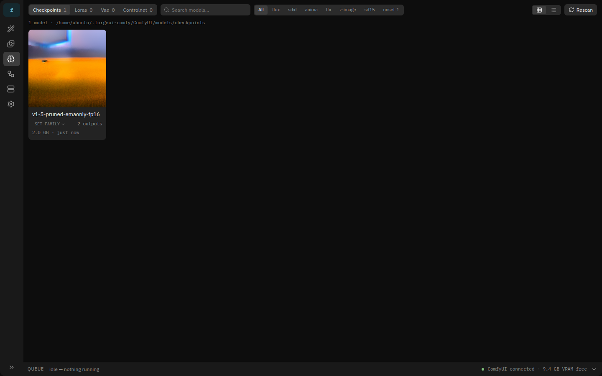
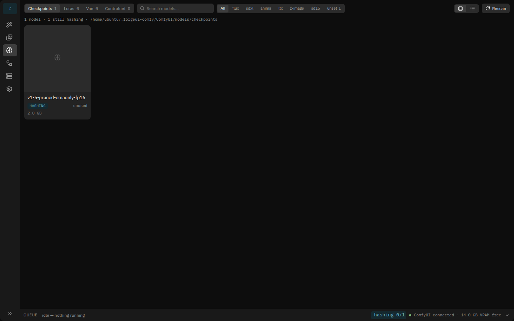
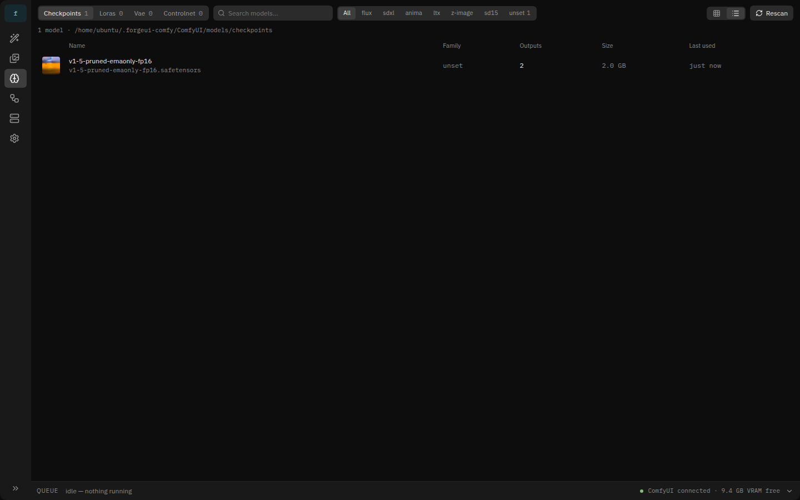
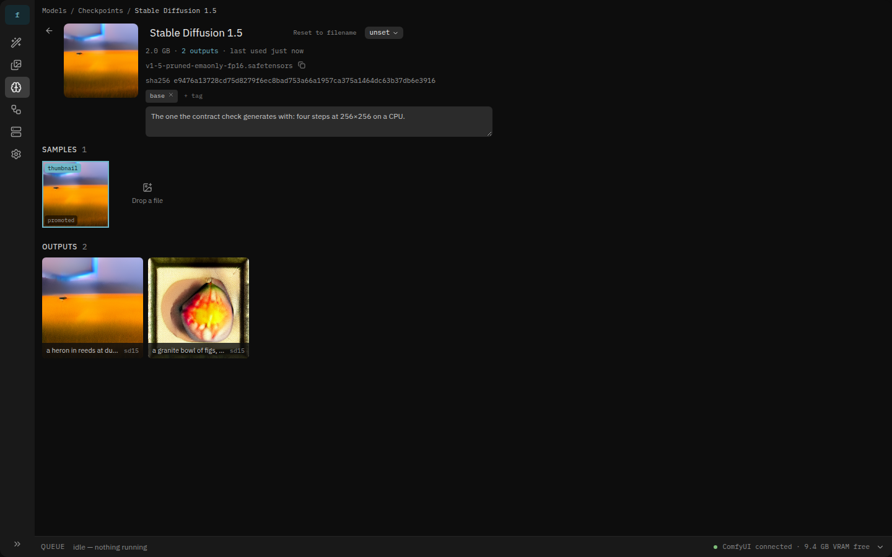
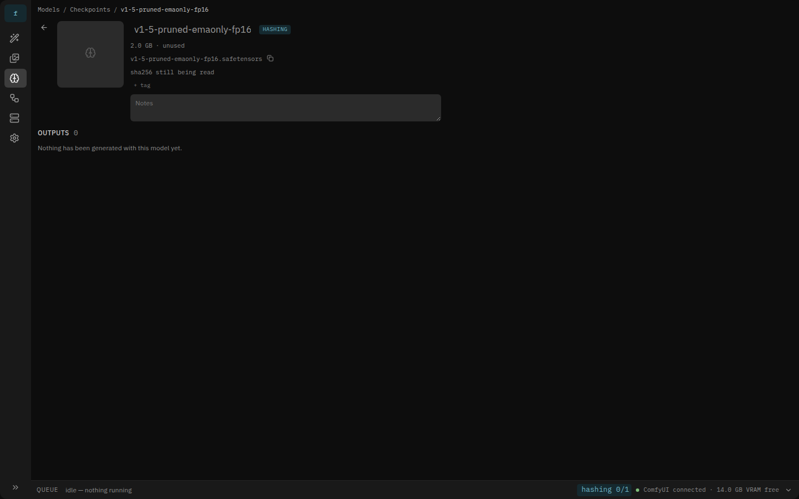
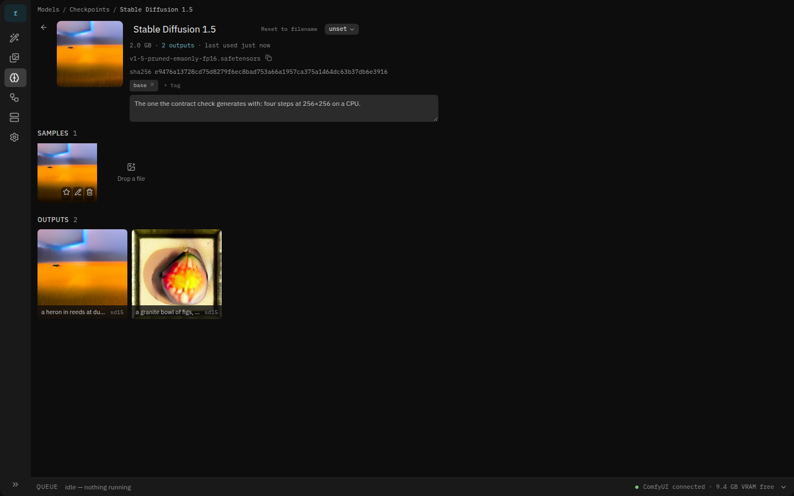
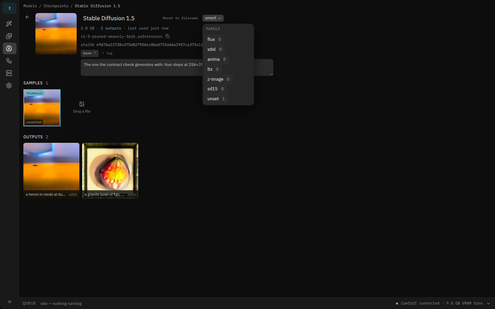
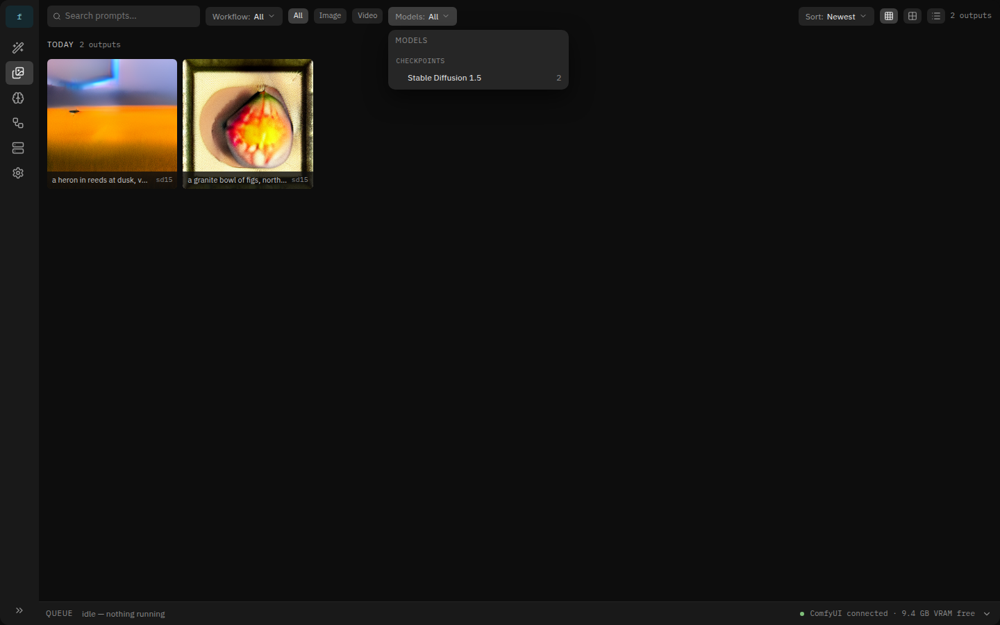
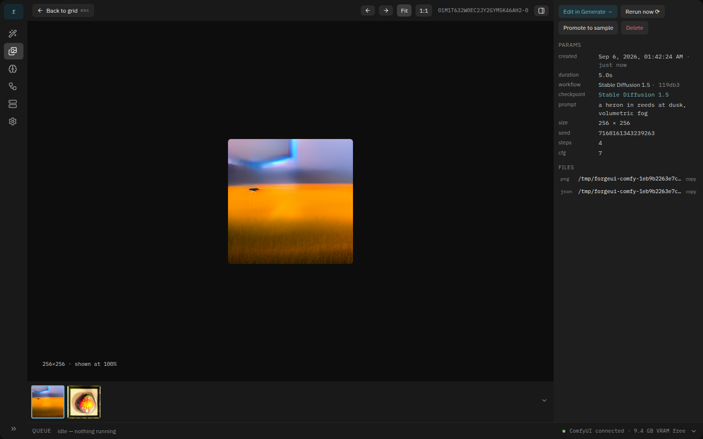
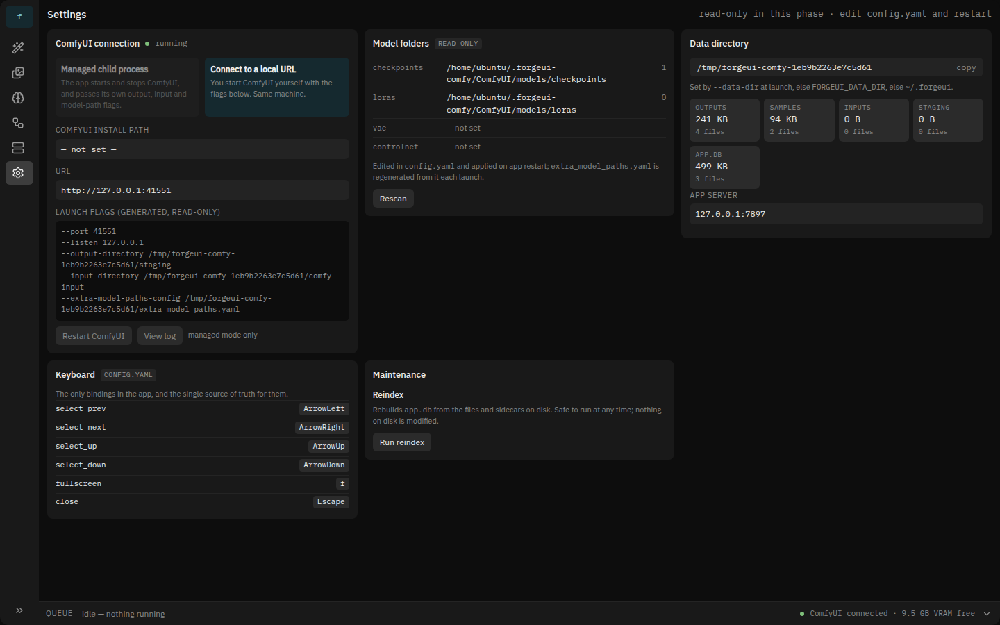

# Phase 2 — completion handoff

Phase 2 of `IMPLEMENT-PHASE-2.md` is complete: M5 through M9, from
`1a2b182` to the tip of this branch. All nine points of that document's
definition of done are met, with the caveats below.

Two things are true now that were not before. **The app has run against a
real ComfyUI**, repeatedly and in CI-shaped commands rather than by hand:
`deno task comfy:setup` provisions a pinned ComfyUI with CPU-only torch and
Stable Diffusion 1.5, and two test suites drive it. And **a model is a thing
in the app**, not a filename in a graph: it has a hash, a name you chose, a
family, tags, notes, samples, a thumbnail, a page, and a count of everything
it made.

## What it looks like

Every screenshot below is from `deno task shots:phase2`, which runs
`tests/e2e/shots-phase2.spec.ts` against the real ComfyUI in a data
directory nothing else has touched. The images are real generations —
Stable Diffusion 1.5, four steps at 256×256 on a CPU — not fixture plates.

**The library here holds one checkpoint and no LoRAs**, because that is what
`comfy:setup` provisions. The mock frames draw a fuller library; read them
for the density, and these for the behaviour.

The Models screen once the scan has finished and the file has been hashed:
tabs carry a count per kind, the family chips carry a count within the tab,
and the card's thumbnail is the model's most recent output because no sample
has been chosen. Compare with mock frame 04.



The same screen a few seconds earlier, during the first scan of a new data
directory. Two gigabytes take about seven seconds to read, and until they
have been read the model is identified by its path: it has a `hashing`
badge, no family control, and the queue strip's status area says `hashing
0/1`.



The table half of the tiles/table toggle.



The model page (mock frame 05), after renaming it in place, tagging it,
writing a note, promoting one of its outputs to a sample and setting that
sample as the thumbnail. The full sha256 is on its own line, selectable and
whole; the filename below it is immutable and never leaves the metadata
line. The Civitai URL field and the "Fetch info" button are not drawn — that
is Phase 3, and the space is left rather than stubbed.



The same page while the file is still being read: every field is disabled
behind the badge, there is no Samples strip to hang media off, and the
sha256 line says what it is waiting for. This is the 409 the API answers,
drawn.



A sample's hover menu — Set as thumbnail, Edit in Generate, Delete. Edit in
Generate is there because this sample was promoted from an output and
carries its params; a dropped file has none and does not offer it.



The family combo: the hardcoded list of §8.1 plus `unset`, with counts, and
no "New family…" (MOCK-REVISIONS §9).



The gallery's models filter (mock frame 09), grouped into checkpoints and
LoRAs, each with the number of outputs behind it. Selections always AND.



The viewer's metadata sidebar: the `checkpoint` row is a link to that
model's page, and shift-clicking it filters the grid to that model instead
of leaving it.



Promote to sample, from the output action row — the models popover
restricted to the models this output actually used, each checkable, with a
confirm (mock frame 09, fourth figure).


Settings (mock frame 08): the storage cards from `GET /api/system/storage`
and the Rescan button, with the model folders still display-only.



**Not pictured:** the LoRA and checkpoint pickers, which gained thumbnails,
output counts, last-used and the "added" state. The provisioned ComfyUI has
no LoRAs, and fixture LoRAs would show empty counts and no thumbnails — a
picture that would misrepresent the change. `tests/e2e/smoke.spec.ts` covers
them against the fake, where two fixture LoRAs exist and one of them is used
by a generation.

## State

| | |
|---|---|
| Backend | 55 TypeScript modules under `src/`, 37 HTTP routes |
| Frontend | 8 screens (Models and Model detail are new), 16 components |
| Tests | `test` 212 · `test:ui` 37 · `test:e2e` 6 · `test:comfy` 14 · `test:e2e:comfy` 3 |
| Clean | `deno fmt`, `deno lint`, `deno check`, `svelte-check`, `prettier` |

```
src/models/     scan.ts (registry) · hasher.ts · backfill.ts · library.ts
src/samples/    store.ts — import, promote, delete, thumbnails
src/jobs/       timings.ts — seeding and the EWMA behind the ETA
scripts/        setup-comfy.sh · with_comfy.ts
tests/contract/ comfy_test.ts (the fake's assumptions) · pipeline_test.ts (the app)
tests/e2e/      comfy.spec.ts · shots-phase2.spec.ts, both against real ComfyUI
```

## Decisions worth knowing before you touch anything

**A model hash is bare lowercase hex.** `models.hash`, `output_models`, every
URL and every API field use it without a prefix. A sidecar written by hand
may spell it `sha256:…`, so `normalizeModelHash()` strips that on the way
into the index. Do not reintroduce the prefix on the way out.

**A model with no hash is addressed by `path:<base64url>`.** It has to be
addressable — it appears in pickers and on the Models screen the moment it
is scanned (§8.1) — but it cannot be edited, so `PATCH` answers 409
`hashing` rather than 404. The frontend router decodes path segments for
exactly this reason; it did not, and an unhashed model's own link 404'd.

**Nothing waits for hashing.** Pickers, generation and the gallery all work
with zero hashed models. The one worker runs at the back of the event loop
and yields between files. If you add something that needs a hash, it
degrades to a path identity or a disabled control — never to an error.

**The backfill index is built once per hashing pass.** Linking a newly
hashed model to the outputs that named it means reading sidecars, which is
O(outputs); doing that per model would not scale. `SidecarModelIndex` is
built on the first fresh hash of a pass and rebuilt only when the outputs
table's stamp changes.

**`output_count` and `last_used_at` are recomputed, never incremented.**
Completion, the backfill, soft delete, restore and reindex all call
`refreshModelUsage()`. Recomputing is cheaper to keep right than five
correct increments.

**Seeding `node_timings` is a rebuild, not an accumulation.** It reads every
sidecar in the order they were written and replaces the table, so running it
twice leaves the same rows — which is what makes it safe on every boot that
finds the table empty, and what lets `reindex` reseed.

**The ETA blends the prior with the measurement.** With history, the
estimate is the remaining weight scaled by a rate that is the measured rate
weighted by how much of the run has finished. Trusting the measurement alone
lets a step boundary crossed in the first half-second announce that the run
is nearly over; trusting the timings alone ignores a machine that got
slower. Without history nothing changed: equal weights and the measured
rate.

**A promoted sample is a hard link.** Deleting the sample removes one name
for the bytes; the output keeps the other. That is asserted by inode, on a
real file, in `tests/contract/pipeline_test.ts`.

**The `/comfy/*` proxy must present ComfyUI's own origin.** ComfyUI answers
403 to any request whose `Origin` does not match the host it serves on, and
every `<script crossorigin>` in its `index.html` sends one. Forwarding the
browser's origin left the embedded editor a blank page for all of Phase 1.

**ComfyUI's frontend appears on the iframe's window long after `load`.** The
editor screen waits for `app.graphToPrompt()` to exist rather than deciding
at the `load` event that the build does not have it.

## What is deliberately absent

Out of Phase 2's scope, and not stubbed: **anything Civitai** — fetch-info,
URL import and the infotext parser are Phase 3, and `civitai_json` stays in
the schema unused. Also absent: content-addressed inputs, `image`/`mask`/
`video` params, Use in workflow, Upscale image, video outputs, sweeps,
`deno compile`, and model downloading of any kind.

Smaller things the mocks draw that this does not:

- **No sort control on the Models screen.** Frame 04 has "sorted by
  outputs"; the list is sorted by display name. §11.2's text does not ask
  for a sort and §12 has no parameter for one.
- **No search field inside the gallery's models filter.** Frame 09 has one;
  the popover lists every hashed model instead. It needs one at a few
  hundred models.
- **No per-model sample count in the Promote popover.** Frame 09 shows
  "4 samples" beside each model; the API does not return it yet.
- **`reindex` does not rebuild `samples`.** Outputs, `output_models` and
  `node_timings` are all rebuilt from files; the samples table is not, so a
  lost `app.db` loses the sample rows while their files and sidecars stay.

## Breadcrumbs left for Phase 3

- `POST /api/models/:hash/samples` already accepts the shape Civitai import
  will need: it answers 501 to `{civitai_url}` and the sample sidecar has a
  `raw` field waiting for unmapped generation data (§8.3).
- `SampleStore.import()` takes a `raw` argument and a `sourceUrl` that
  nothing sets yet; `samples.source_url` is in the schema.
- The model page leaves the space frame 05 gives the Civitai URL field and
  the Fetch info button.
- `src/models/library.ts` is where a Civitai lookup would hang: it already
  owns the registry, the hasher and the metadata patch path.
- The infotext parser has a home in `tests/golden/sidecar/imported-sample/`,
  whose fixture is already the shape an imported sample takes.

## Amendments made to DESIGN.md

DESIGN.md stayed authoritative; five edits were made to it before the code
that needed them, per the conventions:

- §8.1 gains the unhashed model identified by `path`, the `output_models`
  backfill by sidecar name, the payload shapes of `rescan_progress` and
  `hashing_progress`, and `sd15` in the family list.
- §5.1 says `node_timings` is seeded from every existing sidecar's
  `timing.nodes` and updated by EWMA (α = 0.3).
- §13 moves Civitai fetch-info and URL import from Phase 2 to Phase 3.
- §4.6 adds `sd15` to the bundled set, with the reason it is there: its
  weights are a download rather than a choice, so it is the workflow the
  contract check generates with.
- §12 records that an unhashed model is addressed by `path:<base64url>` and
  that `PATCH` answers 409 until the hash lands.

## Running it

```sh
deno task ui:install && deno task ui:build   # once, then whenever the UI changes
deno task start --data-dir ./data

deno task test && deno task test:ui && deno task test:e2e   # no ComfyUI needed
deno task comfy:setup                                       # once, ~3 minutes
deno task test:comfy && deno task test:e2e:comfy            # against the real thing
deno task shots:phase2                                      # regenerate the images above
```

`docs/HARDWARE-CHECKLIST.md` says what the ComfyUI suites prove and what
they still do not — a GPU, the other seven bundled workflows' placeholder
filenames, video, and Windows or macOS.
